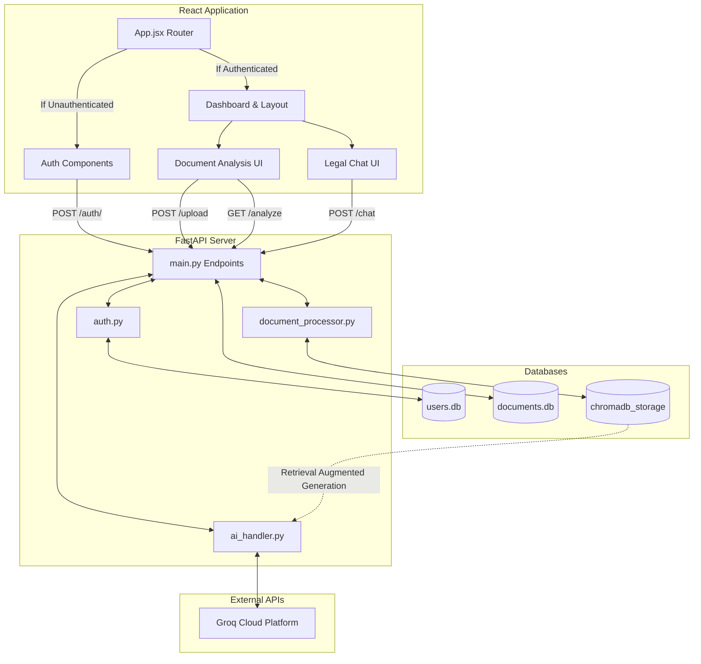
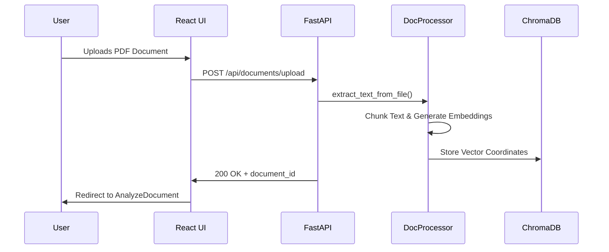

# LegalEase - Project Architecture & Workflow

> [!NOTE]
> This document serves as the foundational Context Map for LegalEase. By reading this page, any AI assistant will fully understand the application's structure, standard design practices, routing flows, and technology stack without having to use tokens to read files individually.

## 1. Project Overview & Tech Stack
LegalEase is a premium, AI-powered legal document analysis and attorney-simulation chat platform built with a high-end neumorphic glass UI.

*   **Frontend**: React (Vite), React Router DOM (v6).
*   **Styling**: SCSS (Neumorphic Design System + CSS Custom Variables).
*   **Backend**: Python FastAPI.
*   **Databases**: SQLite (`users.db`, `documents.db`) and ChromaDB (Vector Store).
*   **AI Engine**: Groq Cloud API (Llama 3 / Mixtral text processing).

---

## 2. Code Structure & Directory Map

```text
d:\ProjectFiles\LegalEase\Dock_Chat\
├── backend/
│   ├── main.py                  # Primary FastAPI router and endpoints.
│   ├── auth.py                  # JWT Auth logic and SQLite user connection.
│   ├── ai_handler.py            # Interfaces with the Groq API for LLM completion.
│   ├── document_processor.py    # Handles parsing chunks and ChromaDB ingestion.
│   ├── legal_handler.py         # Specific legal constraint parsing rules.
│   ├── documents.db             # SQLite Table: Session states, document metadata, histories.
│   ├── users.db                 # SQLite Table: Registered User accounts & hashes.
│   └── chromadb_storage/        # Local persistent Vector Store.
└── frontend/
    ├── public/
    │   └── logo.png             # Dynamically scaling AI logo.
    └── src/
        ├── App.jsx              # React Router structure (Auth gates & layouts).
        ├── index.css            # GLOBAL SCSS variables (Colors, Neumorphic tokens, Border radii).
        ├── components/
        │   ├── Landing/         # Unprotected promotional Hero page.
        │   ├── SignIn/          # Authentication routing.
        │   ├── SignUp/          # Authentication routing.
        │   ├── Layout/          # The flex-column shell. Mounts Sidebar + Main Content router.
        │   ├── Sidebar/         # Collapsible Navigation & chat history.
        │   ├── Home/            # Dashboard landing.
        │   ├── Upload/          # Drag-and-drop document ingestion.
        │   ├── AnalyzeDocument/ # Core analysis view for stored documents.
        │   ├── LegalChat/       # Direct Legal LLM consultation interface.
        │   └── ThemeToggle/     # Dynamic Light/Dark Mode switcher.
        └── utils/
```

---

## 3. Workflow & Data Logic Graphs

### A. Core Architecture



### B. Document Ingestion Workflow (RAG)



---

## 4. Design System Guidelines (For AI Agents)

> [!IMPORTANT]
> When modifying or extending the styling of this application, ALL spacing, formatting, and layout must inherit from the global CSS tokens located in `index.css`. **Do not hardcode dimensions or colors.**

*   **Neumorphism Foundation:** All primary containers MUST utilize `background: var(--bg-primary)` paired with `box-shadow: var(--shadow-md)` to create the floating 3D plastic effect.
*   **Golden Gradients:** Instead of solid borders, primary interactable objects (Sidebar active states, CTAs, Hero Buttons) securely utilize the `[data-theme="dark"]` metallic linear gradient `background-clip` layout to simulate forged golden rings. See `.btn-primary` in `index.css` for the unified structure.
*   **Fully Rounded Edges:** This app strictly follows a pill-rounded aesthetic. Border radii variables are massively inflated. Rely on `var(--radius-md)`, `var(--radius-xl)`, or `var(--radius-full)`.
*   **Layout Scale:** Outer router shells (`.main-content`) utilize `max-width: 1600px` and `margin: 0 auto` to prevent horizontal tearing on ultra-wide monitors.

## 5. Development Status / State
*   **Current State:** Fully structurally integrated. The backend endpoints handle document processing, embedding, and memory chat. The frontend is fully polished with high-tier aesthetic rendering, dark-mode animations, and completely functional routing.
*   **Next Steps Built By User:** Open loops for integration, scaling vector capacity, or fine-tuning specific Legal prompt-injection parameters within `ai_handler.py`.
